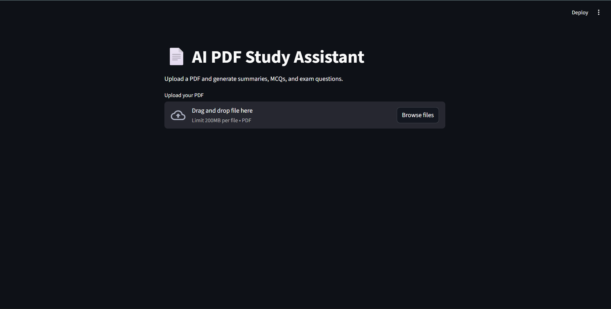
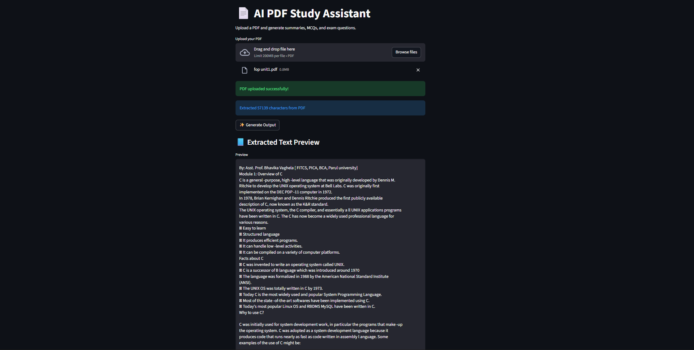

# AI PDF Study Assistant (v1.0)

**Author:** Swapnil Tiwari  
**Degree:** B.Sc. IT (Hons.), Parul University  
**Year:** 2025–2029


## 📌 About the Project

AI PDF Study Assistant is a Streamlit-based application designed to help students work with academic PDF documents.  
The current version (v1.0) focuses on reliable PDF ingestion and text extraction, providing a clean foundation for future AI-powered features.


## 🚀 Current Version: v1.0

### Features
- Upload academic PDF files through a web interface
- Extract structured text from PDFs
- Display extracted content in a readable format
- Lightweight and easy to run locally

> ⚠️ Note: This version focuses on PDF processing only.  
> AI-powered summarization, MCQs, and exam question generation are planned for v2.0.


## 🛠️ Tech Stack

- Python
- Streamlit
- PyPDF2
- Git & GitHub


## 📸 Screenshots

### User Interface


### Extracted PDF Content



## ▶️ How to Run Locally

```bash
git clone https://github.com/sarcasticc-git/ai-pdf-study-assistant.git
cd ai-pdf-study-assistant
python -m venv venv
venv\Scripts\activate
python -m pip install -r requirements.txt
streamlit run app.py
